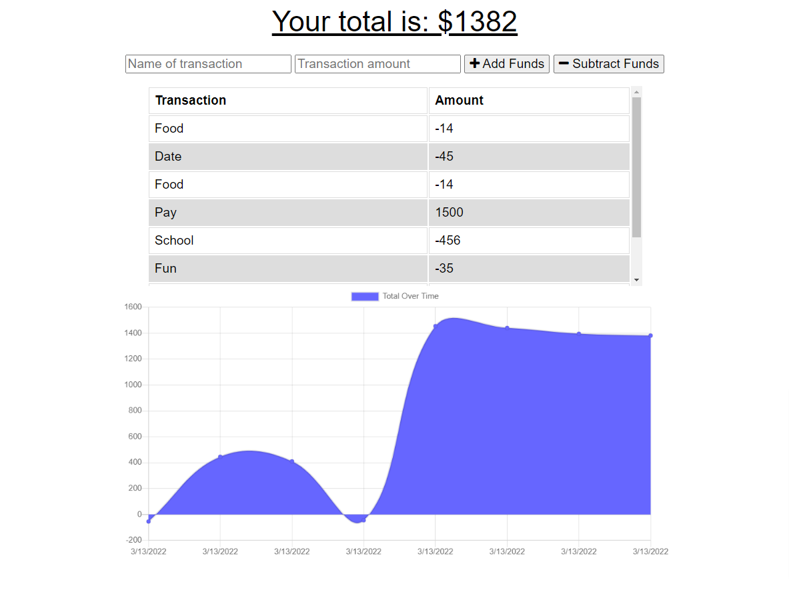

# Budget Tracker (Challenge 19)

## Created By Scott Nichols

 
 -------------------------------
## Description 
This is a budgeting application that will keep track of any incoming or outgoing financial transactions.  Transactions can be entered offline and persist with a lost internet connection.  It uses MongoDB Atlas for the backend database.

## Table of Contents:
  * [Installation](#installation)
  * [Usage](#usage)
  * [License](#license)
  * [Contributing](#contributing)
  * [Tests](#tests)
  * [Questions](#questions)
 --------------------------------- 
## Installation
#### To run this application, the user will need to download the following:
- No installation requried. Simply navigate to the Budget Tracker URL.

## Usage
 #### To use app the user will need to do the following:
  - The application consists of a single landing page.
  - The user is presented with 2 fields for a transaction name and transaction amount.  These fields must be filled out.
  - The user then click on the "Add Funds" button or the "Subtract Funds" button.
  - The user is presented with a list of all past transactions.
  - The users is also presented with a graphical display representing the flow of money in and out of the account over time. 

## License:
 [Link to MIT License Details](https://choosealicense.com/licenses/mit/)

## Tests
  No testing done

## Contributing
  * Scott Nichols

 ---------------------------------
### Questions
* Github Repo: https://github.com/Sessions21/budget-tracker_ch19_sfn
* Deployed Website: https://budget-tracker-sfn.herokuapp.com/
* Contact me with questions: s21nichols@hotmail.com

### Landing Page Example:
 
